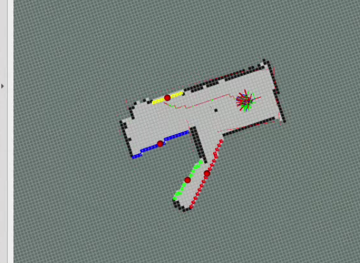
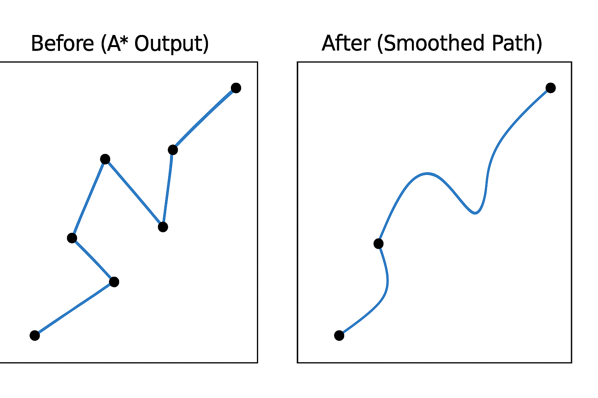

 

# 🏎️ Autonomous Frontier Exploration and Mapping using ROS 2 with Turtlebot4


<p align="center">
  
</p>


---
Authors- Nitesh morem.

 Ostbayerische Technische Hochschule Amberg-Weiden.
 
 Department of Electrical Engineering, Media and Computer Science.
 
 Supervisor - Prof. Dr. -Ing. Thomas Nierhoff


---


This repository implements autonomous exploration and mapping using **ROS 2**, a physical TurtleBot4 robot, and custom navigation logic. The solution is built completely **without Nav2**:

- A\* Path Planning
- Frontier Detection and Clustering
- Exploration Logic
- Dynamic Replanning
- Obstacle Avoidance
- RViz visualization

---

## 🚀 Tasks Achieved

-  **Mapping Node**: Builds an occupancy grid map from LiDAR data.
-  **Frontier Detection**: Detects unexplored boundaries.
-  **Exploration Node**: Chooses reachable frontiers and navigates using custom A\* algorithm.
-  **Path Planning**: Computes a clearance-aware path and publishes it.
-  **Obstacle Avoidance**: Detects obstacles dynamically using LiDAR and performs escape maneuvers.
-  **Visualization**: Frontiers and paths visualized in RViz.

---

##  Core Concepts and Algorithms

### 🔹 Frontier-Based Exploration
- Frontiers are the borders between known and unknown areas.
- The robot continuously selects the **nearest reachable frontier centroid**.
- If a frontier becomes unreachable (due to obstacles), it is skipped.

### 🔹 Custom A\* Path Planning (Cost + clearnace + Penalty)

This project uses a **custom implementation of the A\*** algorithm to generate a path on a grid-based map. Unlike standard A\*, this version is optimized for robot navigation in dynamic and obstacle-rich environments.

####  Key Features of the Custom A\*:

- **Grid-Based Planning**  
  The robot's world is represented as a 2D occupancy grid. Each cell represents either free space, an obstacle, or unknown area. The A\* algorithm plans from the robot’s current grid cell to a selected frontier cell.

- **Clearance-Aware Costing**  
  A custom cost function penalizes cells that are too close to obstacles. This is done using a “clearance value” — the distance from a cell to the nearest obstacle. As the clearance decreases, the penalty increases. This ensures the robot avoids narrow or risky paths and prefers open areas.

- **Dynamic Goal Adjustment**  
  If the robot’s goal (frontier) is inside an obstacle or completely surrounded, the algorithm does not fail. Instead, it automatically selects the **nearest reachable cell** to that goal and creates a path to it. This allows the robot to always have a valid trajectory even in uncertain or cluttered environments.

- **Efficient Pathfinding**  
  The algorithm uses a priority queue (heap) for selecting the lowest-cost path candidates. It considers both the real movement cost and the heuristic distance to the goal. This balances accuracy and speed, allowing frequent replanning even on limited hardware.

- **Adaptive Movement Directions**  
  The algorithm supports both straight and diagonal movement between cells, adapting the movement cost accordingly.

- **Integrated into Real-Time System**  
  A\* is called every time a new frontier is selected or the map is significantly updated (e.g., >5% change). The system checks path validity and triggers replanning if obstacles appear or the robot gets stuck.

#### 📌 Summary
This A\* implementation is tailored specifically for exploration robots. It is obstacle-aware, robust to blocked goals, computationally efficient, and fully integrated with the rest of the exploration pipeline.

```python
clearance_penalty = 10 if clearance == 0 else 2.0 / clearance
```

### 🔹 Path Smoothing

<p align="center">
  
</p>

To improve the smoothness and realism of robot motion, this project applies **B-spline interpolation** to the path generated by A\*. Instead of directly following grid cell corners, the path is curved smoothly while ensuring safety from obstacles.

####  How It Works:

- Takes the discrete (x, y) waypoints from the A* path.
- Uses `scipy.interpolate.splprep` to fit a B-spline curve through those points.
- Evaluates intermediate points (`splev`) to generate a high-resolution smooth path.
- Filters the smooth path with `is_valid_cell()` to ensure no point is near an obstacle.

#### 📌 Pseudocode:

```python
x_coords, y_coords = zip(*path)
tck, _ = splprep([x_coords, y_coords], s=2)
u_new = np.linspace(0, 1, num=len(path) * 5)
smooth_x, smooth_y = splev(u_new, tck)
```

### 🔹 Obstacle Detection & Escape
- Uses front-facing LiDAR data.
- If an obstacle is detected < 0.3m, the robot **rotates in place** to escape.

### 🔹 Dynamic Replanning
- Compares map updates to previous grid.
- If >5% of the map changes or if a timer triggers, **replans the path**.
- Cooldown avoids excessive CPU usage from frequent replanning.

---

## 🗂️ Package Structure
```
ros2_ws5/
├── src/
    └── lidar_mapping/
        ├── launch/
        │   └── mapping_rviz2.launch.py
        ├── lidar_mapping/
        │   ├── exploration_node.py
        │   └── mapping_node.py
        ├── package.xml
        └── setup.py
```

---

## 🔧 Build and Run

### Prerequisites
- ROS 2 Humble
- Python3, `numpy`, `scipy`, `rclpy`

### Build Workspace
```bash
cd ~/ros2_ws5
colcon build
source install/setup.bash
```

### Launch
```bash
ros2 launch lidar_mapping mapping_rviz2.launch.py
```

This will start:
- Mapping node
- Exploration node
- RViz with pre-configured displays

---

## 📊 Visualization in RViz
- Frame: `map`
- Topics:
  - `/map` (`nav_msgs/OccupancyGrid`)
  - `/planned_path` (`nav_msgs/Path`)
  - `/frontier_centroids` (`visualization_msgs/MarkerArray`)
  - `/scan` (`sensor_msgs/LaserScan`)
  - `/odom` and `/tf`

---

## 🔀 Topics Summary

| Topic | Message Type | Description |
|---|---|---|
| `/map` | `nav_msgs/OccupancyGrid` | 2D map used for planning |
| `/scan` | `sensor_msgs/LaserScan` | Obstacle detection |
| `/cmd_vel` | `geometry_msgs/Twist` | Velocity commands |
| `/odom` | `nav_msgs/Odometry` | Robot pose |
| `/planned_path` | `nav_msgs/Path` | Path for visualization |
| `/frontier_centroids` | `visualization_msgs/MarkerArray` | Frontier visualization |

---

## 🌟 Key Highlights
- No Nav2 dependency 
- Lightweight custom exploration logic
- Robust to blocked frontiers
- Works in simulation or with real robot given odom, scan, and map inputs

---

## 🙌 Acknowledgments
Thanks to the open-source community, ROS 2, and the TurtleBot simulation environments.
Also grateful for the insights from Prof. Dr. -Ing. Thomas Nierhoff Lectures of Autonomous Robots OTH Amberg.
